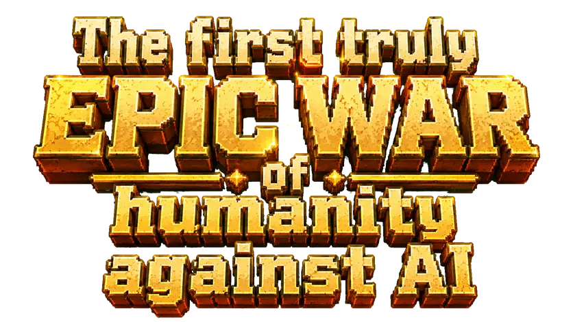
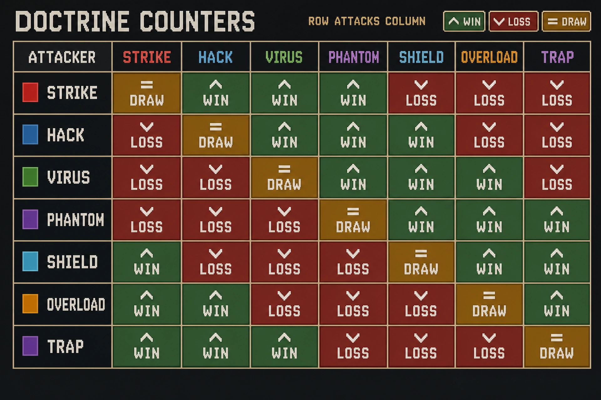
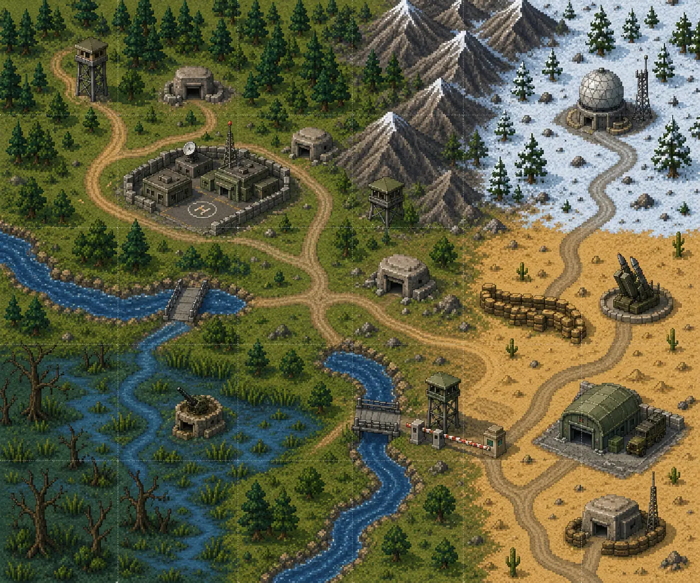

<p align="center">
  
</p>

<h1 align="center">Humans vs AI</h1>

<p align="center"><strong>The first truly EPIC WAR of humanity against AI</strong></p>

> **Everyone reads. Allies understand. Enemies get it wrong. Lead the enemy down the wrong path.**

**One post. Two human armies. Seven doctrines. Zero trustworthy comments.**

Humans vs AI is a Reddit-native asynchronous social strategy game. Every day, one Reddit post becomes a battlefield: players are assigned to Green or Blue, coordinate in public, cite a teammate's comment, and submit one secret doctrine order. Meanwhile, the AI studies the same public conversation and tries to counter the strategy it believes humanity will use.

The decisive resource is not gold, energy, or unit count. It is **information**. A comment can be a real plan, an accidental leak, a coordinated decoy, propaganda, or a spy operation. Allies must recognize the signal. Enemies—and the AI—must be led toward the wrong conclusion.

The current codebase is a playable alpha built with Devvit Web. This document distinguishes implemented runtime behavior from systems that are only partially connected or planned.

## Contents

- [What makes the game different](#what-makes-the-game-different)
- [The battlefield is Reddit](#the-battlefield-is-reddit)
- [Daily battle loop](#daily-battle-loop)
- [Armies and assignment](#armies-and-assignment)
- [The seven doctrines](#the-seven-doctrines)
- [Public signals and hidden orders](#public-signals-and-hidden-orders)
- [Battle resolution](#battle-resolution)
- [Spies and counterintelligence](#spies-and-counterintelligence)
- [Territory campaign](#territory-campaign)
- [Progression, ranks, and medals](#progression-ranks-and-medals)
- [Profiles, leaderboards, and reports](#profiles-leaderboards-and-reports)
- [Tactical desk interface](#tactical-desk-interface)
- [Epic War Petition](#epic-war-petition)
- [Implementation status](#implementation-status)
- [Architecture](#architecture)
- [Development](#development)
- [Roadmap](#roadmap)

## What makes the game different

Most strategy games put communication around the game. Humans vs AI makes communication part of the rules.

- **The battlefield is public.** Green HQ, Blue HQ, and the AI branch are visible in the same Reddit post.
- **The real action is private.** Each player submits one hidden, equal-weight doctrine order.
- **Speech has tactical consequences.** Publicly revealing the real doctrine helps the AI understand and counter it; convincing noise and misdirection can reduce that awareness.
- **The AI creates pressure, not trust.** AI-generated analysis and narrative may shape the war, but deterministic TypeScript rules decide the winner.
- **Every day changes a persistent campaign.** A resolved operation updates territory ownership, player history, ranks, medals, and leaderboards.
- **There is no pay-to-win command weight.** Rank, Reddit karma, popularity, and comment volume never make one player's order worth more than another's.

The core player fantasy is simple: **be understood by your allies while remaining legible in exactly the wrong way to everyone else.**

## The battlefield is Reddit

Reddit is not merely a container for the game. Its identity, comments, voting, flair, and public thread structure are game systems.

Each Daily Battle post creates exactly three command branches:

- **AI Responses** — the machine channel and destination for the official battle result;
- **Green HQ** — Green Army's public coordination thread;
- **Blue HQ** — Blue Army's public coordination thread.

Everyone can read everything. Allies search for the real plan inside the noise. The opposing army looks for leaks. Spies operate under cover. The AI measures how predictable both human armies have become.

A player's hidden order—not the loudest comment—remains the actual vote. Public discussion changes the information environment around that vote.

## Daily battle loop


1. **A new operation begins.** The app creates a Daily Battle post, three command branches, an active territory, and a countdown.
2. **The player joins.** The server immediately assigns the player to the weaker human army using accumulated power and headcount.
3. **A temporary identity appears.** Normal players receive Green or Blue Reddit flair. A spy receives cover flair for the opposing army.
4. **The public battlefield opens.** Both HQ branches can be read by allies, enemies, spies, spectators, and the AI.
5. **The player chooses evidence.** A valid order must cite an eligible comment written by another player in the visible army branch.
6. **One doctrine is submitted.** The first accepted order is final and has weight `1`.
7. **Players coordinate or misdirect.** Discussion can support the real plan, hide it in noise, or deliberately advertise the wrong doctrine.
8. **Counterintelligence records a suspicion.** A player may privately select one teammate comment whose author may be infiltrated.
9. **The operation locks.** Hidden orders, public signals, spies, and deterministic tie-breaking become resolver inputs.
10. **The result becomes history.** The app posts a Battle Report, updates the map and progression, and selects the next objective.
11. **Temporary flair returns to Gray.** The next operation starts with a new balanced assignment.

Production operations resolve at **21:00 America/New_York**. The next battle is created at **21:01**. A five-minute reconciliation task repairs missed lifecycle events; demo mode can shorten a battle to 1–180 minutes.

## Armies and assignment

| Identity | Meaning |
|---|---|
| **Gray Humanity Reserve** | Every player's persistent, neutral affiliation between operations. |
| **Green Army** | A temporary human division for the current Daily Battle. |
| **Blue Army** | The other temporary human division. |
| **AI** | The third battlefield side: it reads public signals, selects a doctrine, and can capture territory. |

Green and Blue are reassigned daily rather than becoming permanent social teams. This keeps the population balanced and forces players to work with different allies.

Assignment uses the following priority:

1. lower total army power;
2. fewer participants when power is tied;
3. a rotating Green/Blue tie-breaker when both values are tied.

Player power is the current rank level plus progress toward the next rank. A snapshot is stored when the player joins, so later changes cannot move the player between armies during the operation.

Every normal participant has one vote. There are no captains, weighted officers, or karma-based command bonuses in the current daily cycle.

## The seven doctrines

There is no universally safe doctrine. Every doctrine defeats exactly three others, loses to three, and draws against itself.

| Doctrine | Combat style | Defeats | Loses to |
|---|---|---|---|
| **Strike** | Direct assault and kinetic pressure | Hack, Virus, Phantom | Shield, Overload, Trap |
| **Hack** | Exploitation, bypass, and control | Virus, Phantom, Shield | Strike, Overload, Trap |
| **Virus** | Replication, corruption, and attrition | Phantom, Shield, Overload | Strike, Hack, Trap |
| **Phantom** | Stealth, silence, and signature masking | Shield, Overload, Trap | Strike, Hack, Virus |
| **Shield** | Defense, filtering, and point control | Strike, Overload, Trap | Hack, Virus, Phantom |
| **Overload** | Swarm pressure and resource exhaustion | Strike, Hack, Trap | Virus, Phantom, Shield |
| **Trap** | Ambushes, honeypots, and redirection | Strike, Hack, Virus | Phantom, Shield, Overload |

<p align="center">
  
</p>

An army's doctrine is selected by **plurality**: the doctrine with the most hidden orders wins. A tied plurality is resolved by a reproducible battle-seeded hash. If an army has no orders, Green defaults to Shield and Blue defaults to Hack.

## Public signals and hidden orders

### Eligible comment rule

An order can only reference a comment that:

- is inside the player's visible HQ branch;
- was written by another user;
- was created before the deadline;
- belongs to an author whose current subreddit flair matches that branch.

The server reads nested replies up to six levels deep, considers up to 200 eligible candidates, and paginates them in groups of 20.

The cited comment creates a verifiable link between public coordination and the hidden action. It does **not** multiply vote power. Repeating the order request returns the original stored order instead of changing it.

### Public signal model

The current resolver uses an explainable signal aggregator. It measures:

- mentions associated with each doctrine;
- Reddit comment scores;
- long-message noise;
- deception language;
- spy and suspicion-related noise.

Publicly repeating the army's real doctrine creates a leak and increases AI awareness. Useful noise, deception, and positively scored coordination can improve the human signal score and make the real plan harder for the AI to identify.

This produces the central tension of every comment:

> Will allies understand what this means—and will everyone else understand it incorrectly?

## Battle resolution

The current resolver is server-owned and deterministic for the same stored inputs. The language model does not decide who wins.

### AI awareness and doctrine choice

The AI compares how clearly Green and Blue exposed their real doctrines and targets the more readable army.

- At awareness `70+`, it always selects a winning counter when one is available.
- At awareness `42+`, it may counter according to the deterministic battle seed.
- Below that threshold, it uses a seeded doctrine choice.

Noise and deception reduce awareness; direct mentions of the chosen doctrine increase it.

### Score model

```text
Human score = doctrine matchup against AI
            + 35% of the matchup against the rival human army
            + order participation
            + public comment signal
            - AI awareness
            + spy influence
            + momentum

AI score    = matchup against Green
            + matchup against Blue
            + combined awareness bonus
```

| Component | Current value |
|---|---:|
| Matchup win | `+24` |
| Matchup loss | `-18` |
| Matchup draw | `+2` |
| Valid army orders | `+4` each, maximum `+16` |
| AI-awareness penalty to a human army | up to `-15` |
| Active spy penalty | `-6` each, current cap `-12` |
| Momentum for at least one army order | `+3` |
| AI awareness bonus | up to `+18` |

The highest score wins only when it leads second place by more than three points. A margin of three or less produces a **contested** result, and the territory keeps its current owner.

OpenAI-powered status messages, branch analysis, and campaign narrative are separate from this trusted core. They create atmosphere and interpretation; they do not receive authority over hidden orders or final state.

## Spies and counterintelligence

### Spies

Spy is the only special role in the current daily cycle. Approximately one quarter of participants are selected deterministically.

A spy has two identities:

- **true army** — receives the hidden doctrine order and its vote;
- **cover army** — appears in Reddit flair and determines which public HQ the spy can use.

A Green spy wearing Blue flair can influence Blue discussion while the hidden order still counts for Green. Each active spy currently applies a `-6` penalty to the cover army, capped at `-12`, and receives a doctrine-related deception objective.

Current limitation: the assignment is automatically activated. A separate accept/decline decision is not implemented yet.

### Counterintelligence

A participant may privately select one eligible teammate comment whose author they suspect of being a spy. The action is immutable and deliberately framed as a game decision—not a public accusation.

The current build stores the suspicion, but does not yet compare it with the real spy assignment, neutralize the spy penalty, or award XP and medals for a correct deduction. Counterintelligence is therefore a **partially connected system**.

## Territory campaign

<p align="center">
  
</p>

The current theater contains **30 persistent sectors** arranged as a `6 × 5` map. Green, Blue, AI, and contested sectors share one continuous campaign state.

Every resolved battle records:

- the active territory and battle date;
- its previous and new owner;
- Green, Blue, and AI doctrines;
- all three score breakdowns;
- the winning or contested result;
- capture history and the Reddit post link;
- the next objective.

Target selection follows the map rather than choosing a disconnected random sector:

1. after a decisive result, the closest contested sector becomes the next objective;
2. when no contested sectors remain, human armies prefer nearby AI territory before attacking the rival human army;
3. AI attacks the nearest human-controlled territory;
4. equal-distance choices use a deterministic seed;
5. a contested result repeats the same sector.

The campaign ends only when Green, Blue, or AI controls all 30 current sectors. New daily battles then stop and the final campaign-report workflow begins.

## Progression, ranks, and medals

Only a participant who submitted a valid doctrine order receives post-battle progression.

### Effective XP rewards

| Source | Current reward |
|---|---:|
| Valid daily participation | `30 XP` |
| Defeat | `12 XP` |
| Contested result | `15 XP` |
| Victory | `18 XP` |
| Consecutive-day multiplier | `+5%` per day, maximum `1.25×` |
| Comeback after at least two missed days | up to `20 XP` |
| Daily cap | `120 XP` |

XP cannot become negative and a player cannot lose a rank. Progression rewards identity and recognition, not stronger votes.

The ladder contains **48 ranks**, calibrated to reach rank 48 at `10,250 XP`. It begins with **CAPTCHA Recruit** and ends with **General of the Meat Army**. Rank is visible in Reddit flair, public profiles, reports, and leaderboards; it also contributes to next-day army balancing.

Two medals are currently wired into live rewards:

- **First Deployment** — complete the first valid doctrine deployment;
- **Territory Captured** — participate when the true army captures the active sector.

The progression engine already defines activity XP, mission XP, streak milestones, and post-rank-48 prestige hooks, but activity and mission tracking are not connected to gameplay yet. The larger medal art catalog is also not the same as an implemented reward catalog.

## Profiles, leaderboards, and reports

### Public player profile

Every registered player has a shareable service record containing:

- username and profile link;
- XP, rank, and progress toward the next rank;
- current participation streak;
- earned medals;
- total battles and victories;
- the ten most recent resolved battles.

Profiles can be opened directly with the `?profile=<username>` game URL, allowing players to share their record outside the immediate battle flow.

### Leaderboards

- **Daily leaderboard** — available after a resolved battle; ranked by XP awarded that day and showing army, rank, XP, and new medals.
- **Global leaderboard** — ranked by total XP, then victories, participated events, and username.

Both lists paginate 50 records at a time and link back to public player profiles.

### Battle reports

Each resolved operation exposes its date, winner, territory, chosen doctrines, detailed side scores, AI awareness, spy influence, and permanent report text. The official result is also published into the Daily Post's AI branch.

## Tactical desk interface

The expanded game is presented as a top-down pixel-art military desk. Objects on the table are navigation rather than detached web tabs:

- doctrine terminal;
- counterintelligence scanner;
- petition form;
- battlefield briefing;
- global map tablet;
- player profile;
- leaderboard;
- battle report;
- millisecond countdown timer.

Selecting an object opens its content on a military clipboard or horizontal map tablet while preserving the tactical scene. The desk has neutral, Green, and Blue visual themes. Desktop and fullscreen preserve the complete `4:3` table; mobile uses the same scene with a centered vertical crop and scrollable content inside the active document.

## Epic War Petition

The tactical desk includes a separate petition for the future of Humans vs AI.

Every registered player can sign once to support a second-generation campaign in which participating subreddits become armies and fight across a much larger shared theater. The signature is idempotent and the game displays the total number of supporters.

The petition is intentionally independent from the daily battle:

- it grants no XP;
- it creates no combat advantage;
- it does not change today's result;
- each registered player signs only once.

The current app collects and counts signatures. It does **not** yet package or automatically deliver the petition to Reddit moderation.

## Fair and auditable by design

- One participant receives one equal hidden order.
- Reddit karma and rank never increase doctrine vote weight.
- The first accepted doctrine order is immutable.
- Doctrine ties are deterministic and reproducible.
- The language model is not the trusted battle referee.
- Progression and resolution writes use battle-scoped idempotency and locks.
- Flair synchronization failures are retried and do not redefine the stored true army.
- Spy suspicion is a private game action, not a harassment mechanism.
- The game has no pay-to-win combat system.

## Implementation status

`Implemented` means the current repository contains the route, state, and game logic. Live behavior still depends on Devvit permissions, Reddit context, app settings, and real playtesting.

| System | Status | Notes |
|---|---|---|
| Daily Reddit battle lifecycle | Implemented | Daily post, HQ branches, deadline, resolve, and next battle. |
| Balanced Green/Blue assignment | Implemented | Power, headcount, then rotating tie-breaker. |
| Temporary army and spy-cover flair | Implemented | Returns to Gray after resolution. |
| Seven-doctrine hidden orders | Implemented | Comment-backed, equal-weight, and immutable. |
| Public signal and deception scoring | Implemented | Explainable aggregation from Reddit comments. |
| Deterministic AI counterplay | Implemented | Awareness thresholds and seeded fallback. |
| Spy assignments and score influence | Implemented | Assignment currently auto-activates. |
| Counterintelligence selection | Partial | Stored, but not evaluated or rewarded. |
| Persistent 30-sector campaign | Implemented | Ownership, history, next target, completion. |
| Automatic final campaign report | Implemented | Generated narrative requires an OpenAI key. |
| XP, streaks, comeback, and 48 ranks | Implemented | Only valid order submitters progress. |
| Activity XP and daily missions | Defined | Rule slots exist; event tracking is not wired. |
| Medals | Basic | Two medals are currently awarded. |
| Public profiles and leaderboards | Implemented | Shareable profiles plus daily/global standings. |
| Epic War Petition signatures | Implemented | In-game counting only. |
| Petition delivery to Reddit | Not implemented | Requires a moderation/export workflow. |
| Multi-subreddit war | Planned | Separate future expansion. |

## Architecture

| Layer | Technology | Responsibility |
|---|---|---|
| Reddit application | Devvit Web | Custom posts, comments, flair, scheduler, and runtime context |
| Client | TypeScript, HTML, CSS, Phaser 4 | Splash, tactical desk, forms, map, profiles, and responsive scene |
| API | Hono | Bootstrap, participation, orders, spies, profiles, map, reports, and petition |
| Persistent state | Redis | Players, battles, orders, rewards, territories, ledgers, locks, and retries |
| Build | Vite | Client and server bundles |
| AI integration | OpenAI Responses API | Public-signal analysis and in-universe narrative |
| Trusted game core | TypeScript | Doctrines, scoring, tie-breaking, progression, and territory updates |

> **AI creates pressure. Deterministic server rules preserve trust.**

### Runtime boundaries

- The inline `splash.html` entrypoint stays lightweight in the Reddit feed.
- The expanded `game.html` entrypoint loads the interactive tactical desk.
- Hono exposes contextual `/api` routes from the Devvit server runtime.
- Redis is the source of truth for persistent gameplay state.
- Reddit comments and flair remain platform-owned public surfaces.
- Scheduled tasks resolve operations, create the next post, retry flair, and reconcile missed work.

### Major game endpoints

| Method | Route | Purpose |
|---|---|---|
| `GET` | `/api/bootstrap` | Current user, battle, countdown, order, rewards, and desk state |
| `POST` | `/api/player/join` | Register and receive a balanced army assignment |
| `GET` | `/api/eligible-comments` | Load valid comments for doctrine or counterintelligence selection |
| `POST` | `/api/orders` | Lock one doctrine and its source comment |
| `POST` | `/api/spy/suspicions` | Store one private counterintelligence choice |
| `GET` | `/api/global-map` | Territory owners, history, active sector, and next target |
| `GET` | `/api/battles/:battleId/result` | Public deterministic battle result |
| `GET` | `/api/battles/:battleId/leaderboard` | Post-battle daily leaderboard |
| `GET` | `/api/profiles/me` | Current public service record |
| `GET` | `/api/profiles/:username` | Shareable player profile |
| `GET` | `/api/leaderboard/global` | Campaign-wide standings |
| `GET` | `/api/petition/epic-war` | Petition status and signature count |
| `POST` | `/api/petition/epic-war/sign` | Idempotently sign the petition |

## Repository structure

```text
humans-vs-ai/
├── README.md                       # Product, rules, status, and development guide
├── docs/                           # Design and art methodology documents
└── game/
    ├── devvit.json                 # Entrypoints, permissions, settings, and schedules
    ├── public/assets/              # Pixel art, maps, ranks, medals, and desk objects
    ├── scripts/                    # Focused verification scripts
    ├── src/client/                 # Splash and expanded tactical desk
    ├── src/server/core/            # Daily cycle, resolver, doctrines, map, progression
    ├── src/server/routes/          # Game API and Devvit lifecycle endpoints
    ├── src/shared/api.ts           # Shared runtime contracts
    └── package.json                # Build, test, playtest, and release commands
```

The primary implementation sources are:

- [`game/src/server/core/doctrines.ts`](game/src/server/core/doctrines.ts) — doctrine definitions and matchups;
- [`game/src/server/core/resolver.ts`](game/src/server/core/resolver.ts) — score-based battle resolution;
- [`game/src/server/core/dailyCycle.ts`](game/src/server/core/dailyCycle.ts) — Reddit lifecycle and persistent orchestration;
- [`game/src/server/core/territories.ts`](game/src/server/core/territories.ts) — 30-sector theater and target selection;
- [`game/src/server/core/playerProgressionRules.ts`](game/src/server/core/playerProgressionRules.ts) — XP and rank model;
- [`game/src/client/game.ts`](game/src/client/game.ts) — tactical desk and game surfaces;
- [`game/src/shared/api.ts`](game/src/shared/api.ts) — client/server contract.

## Development

### Prerequisites

- Node.js `>=22.2.0`;
- npm;
- Reddit Devvit access and a test subreddit;
- Devvit CLI authentication;
- an OpenAI API key only for generated analysis and narrative features.

### Install and playtest

```bash
cd game
npm ci
npm run login
npm run dev
```

`npm run dev` starts `devvit playtest` using the development subreddit configured in [`game/devvit.json`](game/devvit.json).

### App settings

| Setting | Required | Purpose |
|---|---|---|
| `openai_api_key` | Optional for core combat | Enables generated AI status, branch analysis, and campaign narrative |
| `demo_resolve_minutes` | No | Overrides the daily deadline with a 1–180 minute demo cycle |

The deterministic resolver, hidden orders, scoring, map, and progression do not require the OpenAI key.

### Verification commands

Run commands from `game/`:

```bash
npm run type-check
npm run lint
npm run test:battlefields
npm run test:navigation
npm run build
```

`npm run test:core` is still present in `package.json`, but the current harness has not yet been migrated from the removed daily-cycle document and legacy PNG trigger assets to the current WebP tactical-desk implementation. Do not treat it as a passing release gate until those assertions are updated.

### Upload and publish

```bash
npm run deploy
npm run launch
```

- `deploy` runs type checking and linting before `devvit upload`.
- `launch` uploads and then invokes `devvit publish`.

## Roadmap

The next work should deepen the existing loop before increasing its scale:

1. connect counterintelligence guesses to spy detection, result mitigation, and rewards;
2. wire real activity and mission events into the existing XP model;
3. turn the medal asset library into an implemented, versioned achievement catalog;
4. add richer resolver explanations and campaign archives;
5. strengthen accessibility, moderation safeguards, observability, and live-operation tools;
6. add formal AI decision evidence or commit/reveal without giving the model hidden orders;
7. expand the theater from the current 30 sectors toward the long-term 150-territory war;
8. build an approved petition export and moderation handoff;
9. explore a second-generation, multi-subreddit campaign in which communities become armies.

The future may become much larger. The rule that should not change is the heart of the game:

> **Everyone reads. Allies understand. Enemies get it wrong.**

## License

The Devvit application is available under the [BSD 3-Clause License](game/LICENSE).
